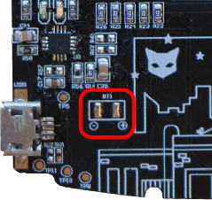

# Power Management
## Intro
At the core of power management is the Texas Instrument BQ24075 power management integrated circuit (PMIC). The BQ24075 is an integrated Li-ion linear charger and system power path management device targeted at space-limited applications. The PMIC provides system voltage (VSYS) with five volts (5V) from USB if plugged in, or battery voltage if USB is not plugged in. The PMIC automatically handles charging of the battery while USB is plugged in as well. Detailed information can be found in the related documents linked below.

## Connecting The Battery:
Located in the lower left hand side of the PCB are two exposed based where a battery can be connected. The pads are labeled BAT in silk screen and also have a + and a - indicating which pad is which.  



Shipping a battery is difficult in the U.S., and finding quality battery vendors requires minimum order quanitites well outside the budget this project at this point in time.  We found that [Adafruit's 3.7V 350MAH lithium ion polymer battery](https://www.adafruit.com/product/2750) from PKCELL is a great battery and we strongly suggest integrating it into your project. If you find an alternative, let us know! We'll test your suggestion and add it to the list of support batteries!

## How to read BAT voltage
Battery management can be done with a simple analog read of the battery's voltage line. Use the voltage readings to write a bit of battery management wizardry like display a battery status indicator, or perform an automatic sleep state turning off the radio, screen, and trackpad when the battery reaches a certain voltage.

## Example Battery Managment Code Snippet
``` cpp
#define BAT_PIN A7

void setup() {
  // Initialize serial communication
  Serial.begin(9600);

  // Pause setup while serial monitor is not opened
  while (!Serial);

  // Define batteryPin mode
  pinMode(BAT_PIN, INPUT);
}

void loop () {
  // Read the input voltage on batteryPin
  int batteryVoltageRaw = analogRead(BAT_PIN);

  // Convert the analog reading (which goes from 0 - 1023) to a voltage 0 - 5.
  float batteryVoltage = batteryVoltageRaw * (5.0/1023.0);

  Serial.println(batteryVoltage);
}
```

## Related Documentation
[Texas Instrument BQ24075 IC](http://www.ti.com/product/BQ24075-Q1)
