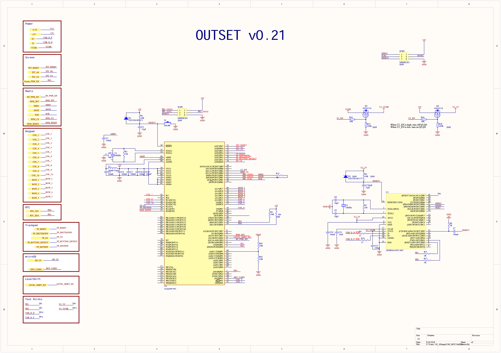
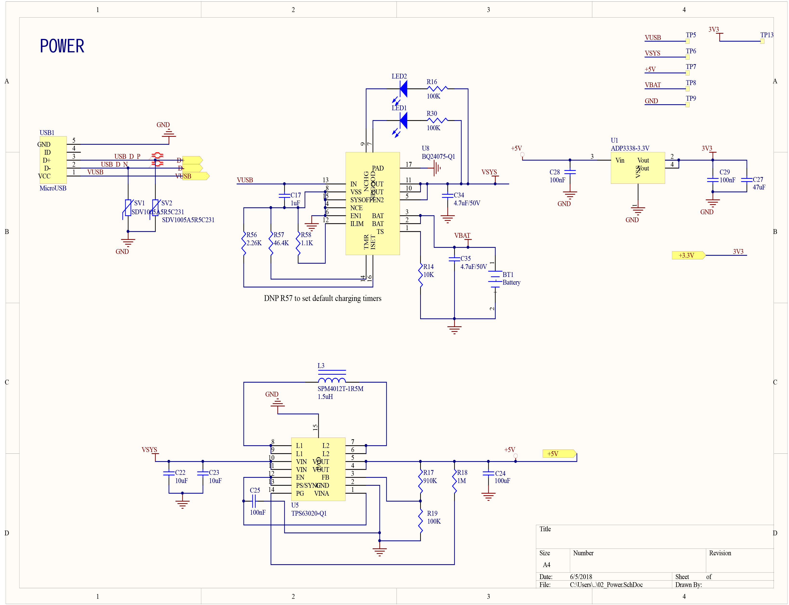
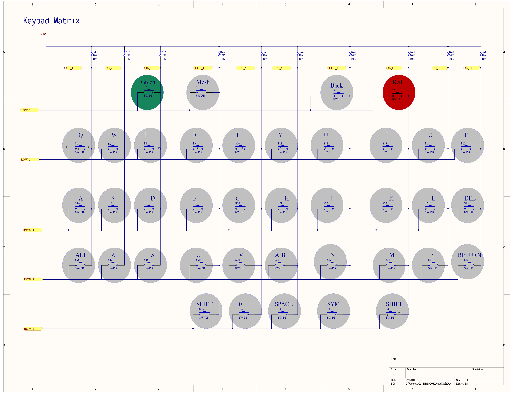
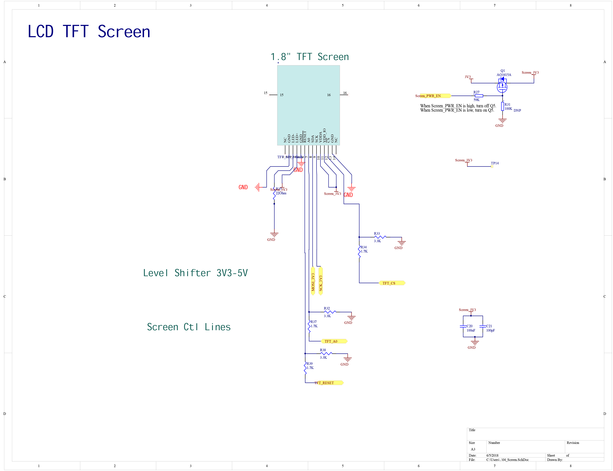
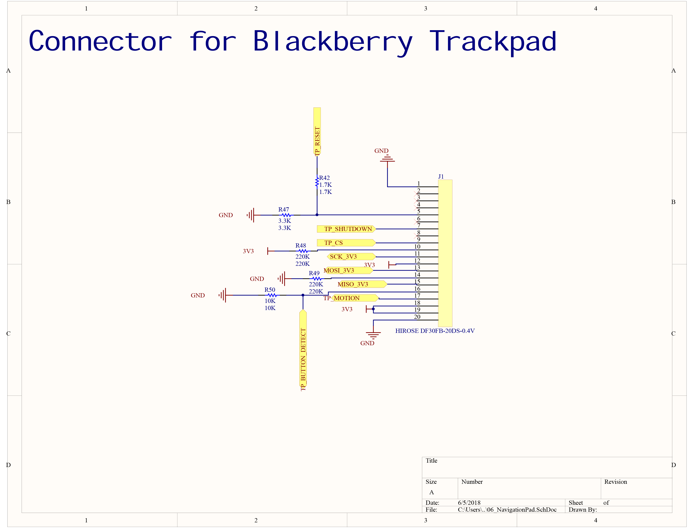
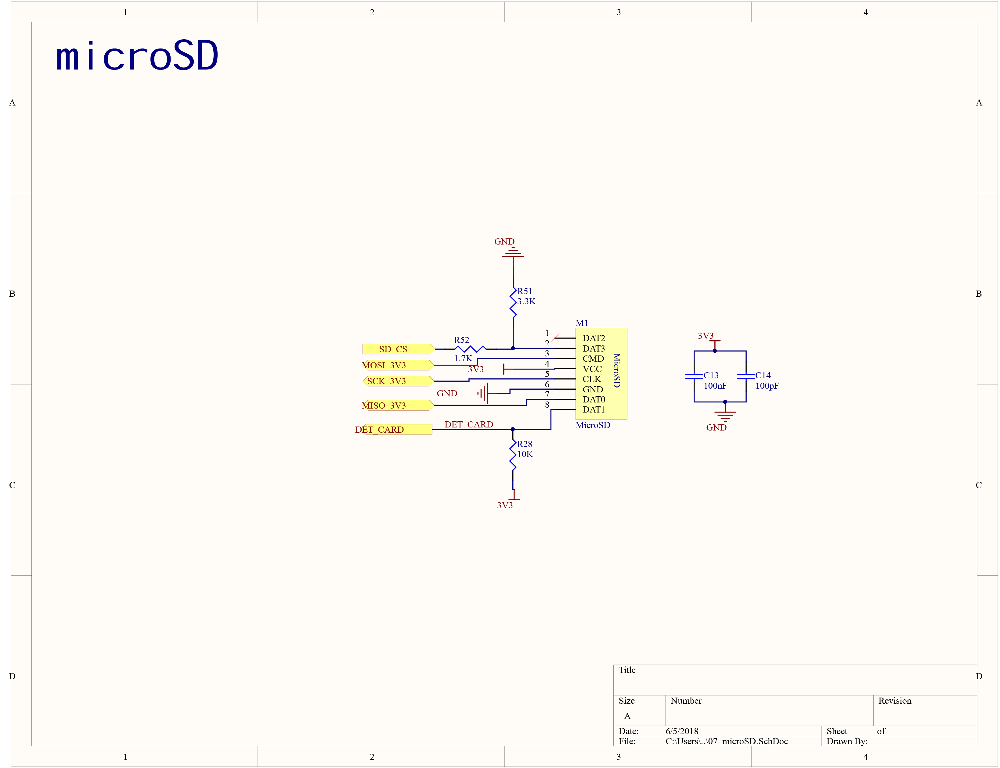
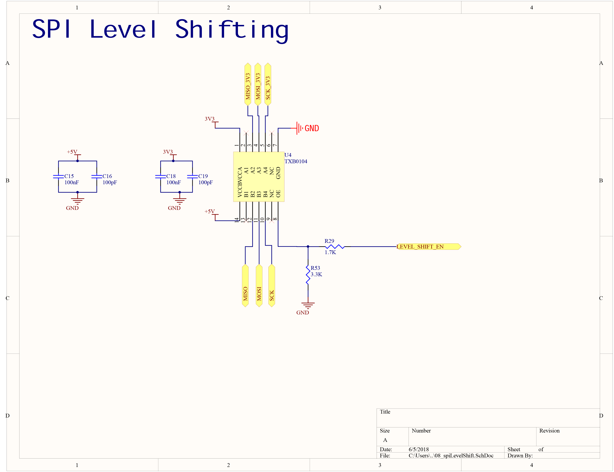
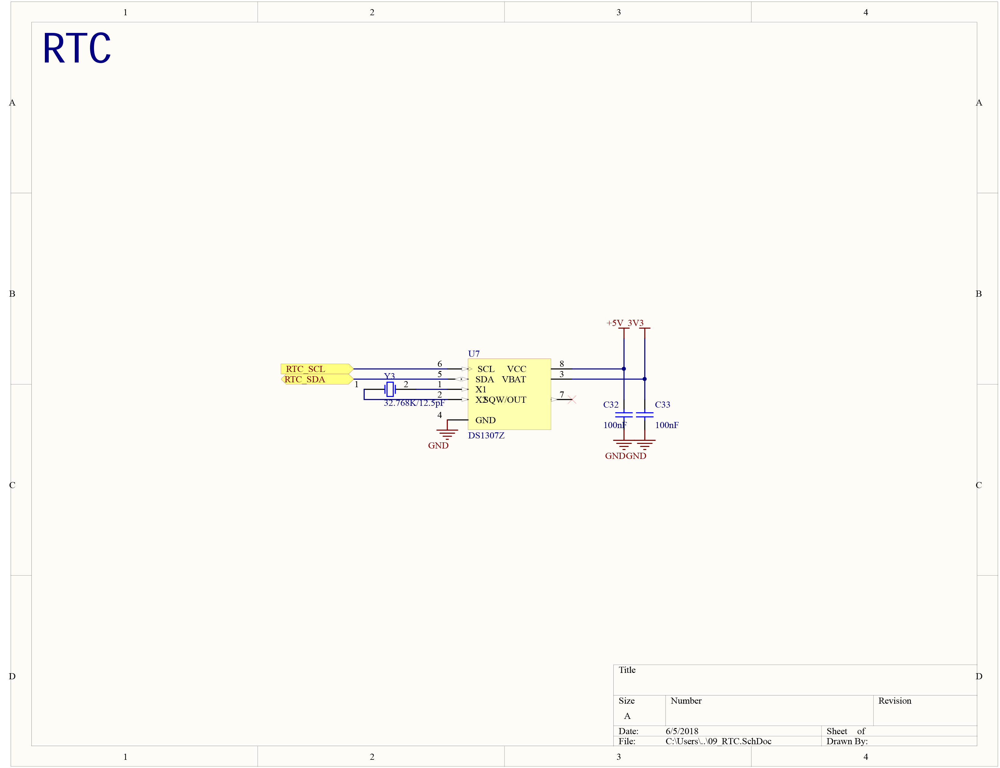

# Schematic
<a href="outset_schematic.pdf" target="_blank">Download the PDF schematic</a>

## Overall

## Power

## Keypad

## Screen

## Radio

## Trackpad

## Micro SD

## SPI Level Shifter

## RTC

## PCB

