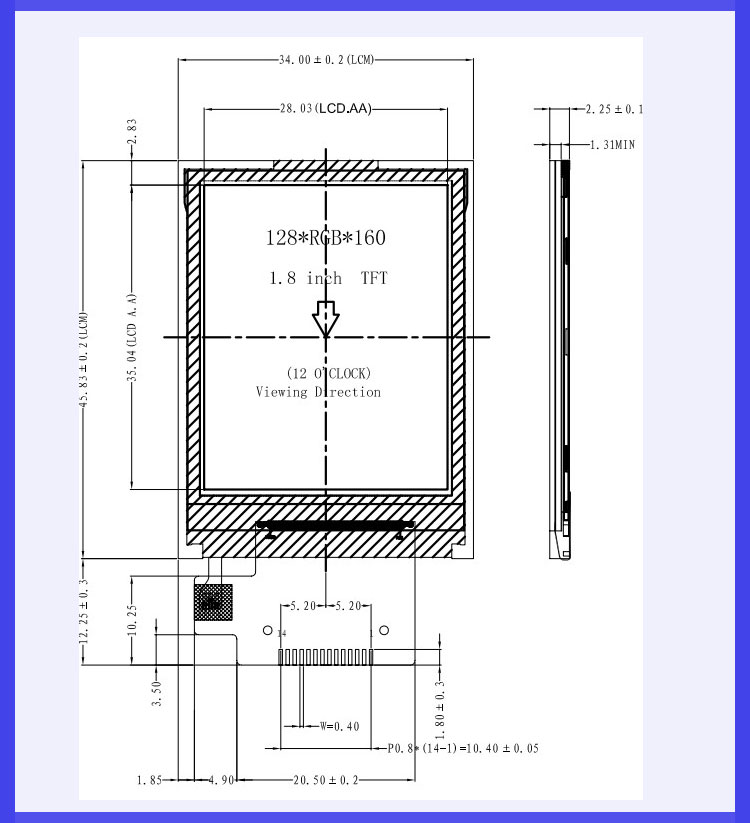
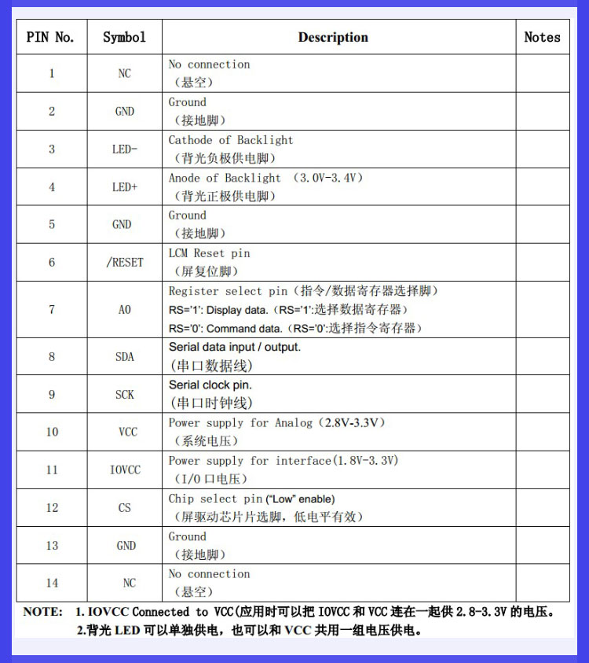

# Screen
## Intro
Display your messages, UI, or LoRa content on the full color 1.8" TFT LCD.  The screen has a 160 x 128 pixels resolution and the ST7735R is easy to integrate with over SPI.  We've chosen a screen that is well documented on the Adafruit website and has many pre-written libraries to make getting started even easier. We've added a mosfet to the circuit to control power to the display to help save on battery power when the screen is not needed.

## Hardware Dimensions


## Pinout Definitions


## Working with the Screen
::: tip Heads Up!
The screen runs at 3.3 volts, so we have added the TXB0104 level shifter from the AtMega 2560 mcu to handle high speed bi-directional data. In order to transmit SPI data correctly, remember to set the TXB0104's OE pin low upon startup, and then set the pin high to enable level shifted SPI communication. Failure to do so can damage devices on the line. 
:::

::: warning !
Power to the screen is controlled via an AO2415A high side mosfet.  When the mosfet's control pin is set high, power to the screen will be disconnected. When the mosfet's control pin is set low, the screen will receive power and turn on.  Use this mosfet to turn off the screen and put the device into sleep mode.
:::

::: danger !
The RFM95 radio, trackpad, and microSD card slot are also connected to the level shifter SPI lines, so remember to set these devices' chip select pins accordingly to ensure they do not interfere with your screen communication.
:::
After you've verified the notes above, getting started with the screen is relatively easy.  We suggest starting with the Arduino TFT library that we have outlined below.  We've included one example displaying text, and a second example displaying a .bmp from the SD card slot.

## Library
We can use the Arduino TFT library included in the Arduino IDE (version 1.0.5 or later) to manage communication between our development board and the TFT LCD screen.

The Arduino TFT library extends the Adafruit GFX, and Adafruit ST7735 libraries that it is based on. The GFX library is responsible for the drawing routines, while the ST7735 library is specific to the screen on the Arduino TFT. The Arduino specific additions were designed to work as similarly to the Processing API as possible.

The TFT library also relies on the SPI library for communication with the screen and needs to be included.

## Example code
Here is an example of the screen displaying text:
``` cpp
#include <SPI.h>
#include <TFT.h>

// Pin definition for our dev board
#define TFT_CS    27
#define TFT_DC    28
#define TFT_RST   29
#define TFT_PWR   4
#define LVL_SHIFT 2

// Create an instance of the TFT object
TFT TFTscreen = TFT(TFT_CS, TFT_DC, TFT_RST);

void setup() {
  // Setup the level shifter pin and the TFT power pin
  pinMode(LVL_SHIFT, OUTPUT);
  digitalWrite(LVL_SHIFT, LOW);
  pinMode(TFT_PWR, OUTPUT);
  digitalWrite(TFT_PWR, HIGH);
  delay(1000);

  // Bring level shifter high and screen power low
  // This enables the screen to receive power
  digitalWrite(LVL_SHIFT, HIGH);
  digitalWrite(TFT_PWR, LOW);

  TFTscreen.begin();

  // Clear the screen with a black background
  TFTscreen.background(0, 0, 0);

  // Set the font color to white
  TFTscreen.stroke(255, 255, 255);

  // Set the font size
  TFTscreen.setTextSize(2);
}

void loop() {
  // Write the text to the top left corner of the screen
  TFTscreen.text("Hello World!", 0, 0);
}
```

For a feature rich screen, try loading images from the SD card as well:
``` cpp
#include <SPI.h>
#include <SD.h>
#include <TFT.h>

// Pin definition for our dev board
#define TFT_CS    27
#define TFT_DC    28
#define TFT_RST   29
#define TFT_PWR   4
#define SD_CD     22
#define LVL_SHIFT 2

// Create an instance of the TFT object
TFT TFTscreen = TFT(TFT_CS, TFT_DC, TFT_RST);

// The image to be drawn on screen
PImage image;

// Set up instances from the SD utility library
Sd2Card card;
SdVolume volume;
SdFile root;

void setup() {
  // Setup the level shifter pin and the TFT power pin
  pinMode(LVL_SHIFT, OUTPUT);
  digitalWrite(LVL_SHIFT, LOW);
  pinMode(TFT_PWR, OUTPUT);
  digitalWrite(TFT_PWR, HIGH);
  delay(1000);

  // Bring level shifter high and screen power low
  // This enables the screen to receive power
  digitalWrite(LVL_SHIFT, HIGH);
  digitalWrite(TFT_PWR, LOW);

  TFTscreen.begin();

  // Clear the screen with a black background
  TFTscreen.background(0, 0, 0);

  // Set the font color to white
  TFTscreen.stroke(255, 255, 255);

  // Set the font size
  TFTscreen.setTextSize(2);

  if (!SD.begin(SD_CS)) {
    TFTscreen.text("SD init FAILED!", 0, 0);
  } else {
    TFTscreen.text("SD init OK!", 0, 0);
  }
  delay(2000);
  // Clear the screen with a black background
  TFTscreen.background(0, 0, 0);

  image = TFTscreen.loadImage("<imagename>.bmp");
}

void loop() {
  // Write the to the top left corner of the screen
  if (!image.isValid()) {
    TFTscreen.text("image is invalid", 0, 0);
  } else {
    TFTscreen.text("Hello World!", 0, 0);

    int x = TFTscreen.width() - image.width();
    int y = TFTscreen.height() - image.height();

    // Draw the image to the screen
    TFTscreen.image(image, x, y);
  }

  // Wait before drawing again
  delay(1500);
}
```

## Related documentation
[Arduino TFT Library](http://www.arduino.cc/en/Reference/TFTLibrary)

[Arduino TFT Source Code](http://github.com/arduino-libraries/TFT)

[Adafruit GFX Library](http://github.com/adafruit/Adafruit-GFX-Library)

[Adafruit ST7735 Library](http://github.com/adafruit/Adafruit-ST7735-Library)

[Processing API](http://processing.org/reference/)

[Replacement Screen Product Page](http://www.adafruit.com/product/618?gclid=CjwKCAjwgYPZBRBoEiwA2XeupcHyJD6ue7QIIfes3cSHH3tqSKE2JgLOSNm2Afju_Abxn2sevnob8RoChVwQAvD_BwE)
